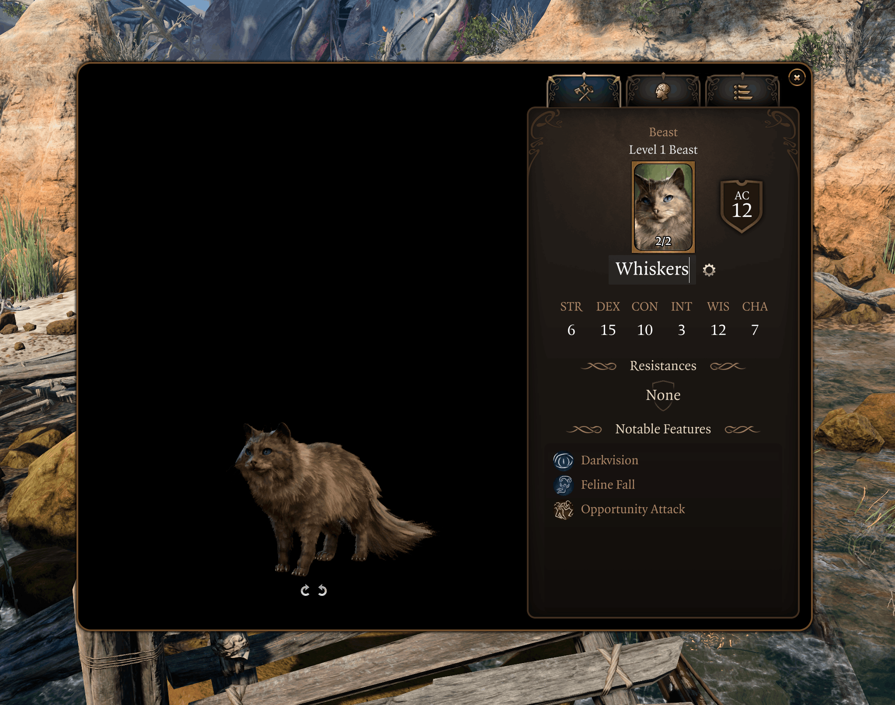
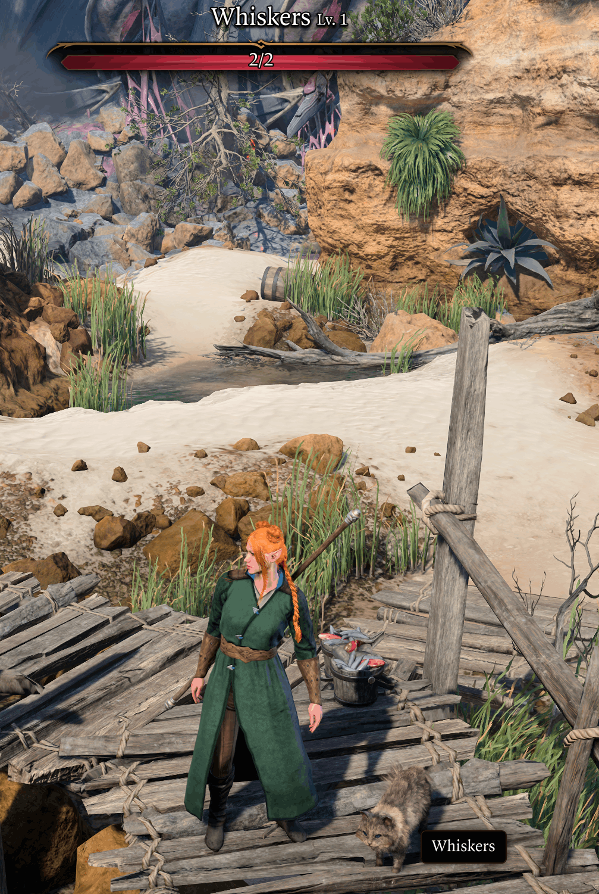
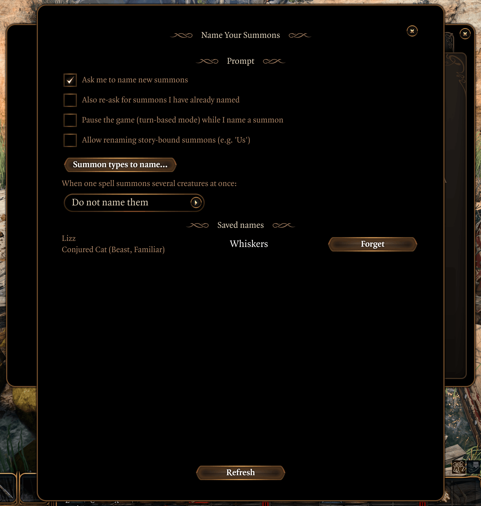

<h1 align="center">Name Your Summons</h1>

<i>a BG3 mod for naming your summons</i>

<a href="https://github.com/whme/bg3-name-your-summons"></img></a>

Names your summoned creatures, remembers the names, and reapplies them
automatically the next time you summon the same creature. Optionally opens the
creature's Examine panel to name it the moment a summon appears.

## Requirements

| Mod name | Notes |
|---|---|
| [Baldur's Gate 3 Script Extender](https://github.com/Norbyte/bg3se) (BG3SE) | **Required.** Built against Script Extender API v30 - install a build that supports v30 or newer. |

## Installing

Install both parts in order.

| Step | How |
|---|---|
| 1. Script Extender | Download the latest updater from the [BG3SE releases](https://github.com/Norbyte/bg3se/releases) page and extract `DWrite.dll` into the game's `bin` folder, next to `bg3.exe` (e.g. `...\steamapps\common\Baldurs Gate 3\bin\`). It downloads and updates itself the next time you launch the game. |
| 2. Name Your Summons | Download the latest `.pak` from the [Releases](https://github.com/whme/bg3-name-your-summons/releases) page and drop it in `%LOCALAPPDATA%\Larian Studios\Baldur's Gate 3\Mods\`. |
| 3. Enable it | Launch the game and enable **Name Your Summons** from the **Mods** menu. |

Want to build from source instead? See [CONTRIBUTING.md](CONTRIBUTING.md).

<h1 align="center">Using it</h3>

<a href="https://github.com/whme/bg3-name-your-summons"></img></a>

Summon something. The creature's Examine panel opens with its name field ready
to edit, pre-filled with its current name, so you can name it in peace. Type a
name and press Enter - or click away - to keep it, then close the panel (its
close button or Escape) to carry on. Closing without typing a name declines for
now; you'll be asked again the next time that creature is summoned. The name
comes back automatically every time you re-summon that creature. A spell that
summons several creatures at once shows them one at a time: name (or skip) each
creature and close its panel, and the next one's opens.

<a href="https://github.com/whme/bg3-name-your-summons"></img></a>

If you would rather not be rushed, the settings offer a toggle to freeze the
world while you name a summon. It is off by default; turn it on and, out of
combat, the freeze is solo turn-based mode (the same pause the tactical camera
uses), while in combat your turn is already paused so nothing extra happens.
Play resumes as soon as you have dealt with every summon.

Each summoner keeps its own names, and different familiar shapes (cat, raven,
spider) are remembered separately.

#### Renaming from the Examine panel

You can also rename a summon any time from its Examine screen (right-click the
creature -> *Examine*). Summons get an editable name field in place of the usual
name: click it, type, and press Enter - or just click away - to rename. The gear
button next to the field opens the config window. This uses the same saved names
as the prompt, so a rename here sticks and comes back on the next summon.

<h1 align="center">In-game config</h3>

<a href="https://github.com/whme/bg3-name-your-summons"></img></a>

The gear button next to the Examine name field opens the config window. There
you can:

- Review every saved name in the current save, grouped by the character that
  summoned it, then edit or forget any of them. Nothing takes effect until you
  press Save; closing the window discards unsaved edits. Saving applies each
  rename to any matching summon that is currently out, and reverts any summon
  whose name you forgot back to its original.
- Choose when the prompt appears:
  - **Ask me to name new summons** - turn the prompt on or off entirely.
  - **Also re-ask for summons I have already named** - when on, the prompt
    reappears for a summon that already has a saved name (pre-filled, so you can
    keep or change it); when off, a saved name is reapplied silently.
  - **Allow renaming story-bound summons (e.g. 'Us')** - off by default, so named
    story creatures like the intellect devourer "Us" are never offered the rename
    prompt; turn it on to name them like any other summon.
- Pick which **summon types to name** by creature type. Only familiars are
  prompted by default. A Find Familiar summon counts as a Familiar whatever its
  creature type, so an undead or fiend familiar is covered by the "Familiars"
  toggle, not by "Undead" or "Fiend" - the creature-type toggles govern
  non-familiar summons. "Every summon" ignores the filter entirely.

Settings and names live in the host's save.

## Multiplayer

Names are stored in the host's save and only the summoner is prompted. This
should work in co-op, but is untested.

## Shout Outs

This mod would not exist without the tools, references, and groundwork built by
others. Huge thanks to:

- **[Norbyte](https://github.com/Norbyte)** - for the [Baldur's Gate 3 Script
  Extender](https://github.com/Norbyte/bg3se) that everything here runs on, for
  [LSLib / `divine.exe`](https://github.com/Norbyte/lslib) that packs the mod and
  lets us unpack the game's own files, and for the `ExtIdeHelpers.lua` type
  definitions that make the Lua API navigable.
- **[LaughingLeader](https://github.com/LaughingLeader)** - for
  [BG3ModdingTools](https://github.com/LaughingLeader/BG3ModdingTools), the
  generated reference for every Osiris function and event the detection pipeline
  relies on.

## License

The mod's original code is released under the [MIT License](LICENSE). Game
content bundled for the UI override and the screenshots belongs to Larian
Studios and is used under Larian's mod policy; see [NOTICE.md](NOTICE.md) for the
full carve-out, trademarks, and disclaimer. Unofficial mod - not affiliated with
Larian Studios or Wizards of the Coast.
